# Compiling the first dll

This tutorial got written by VaDe for the Wiki
(<http://www.maxinmontreal.com/wiki/index.php5?title=Part_A:_Compiling_the_first_dll>).

## Step 1

Download MSVSE 2008 here: <http://www.microsoft.com/express/download/> -
Install with custom settings; there is no need to change anything.

## Step 2

Create a new project: File -\> New -\> Project.

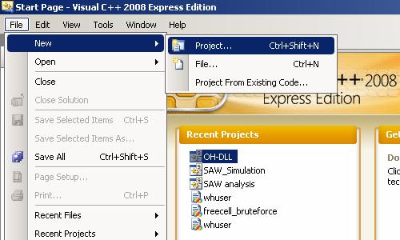

## Step 3

Choose Win32 Project Application, you can choose any name/directory you
want for your project, but I suggest you stick with OH-DLL and
C:\Projects for this tutorial

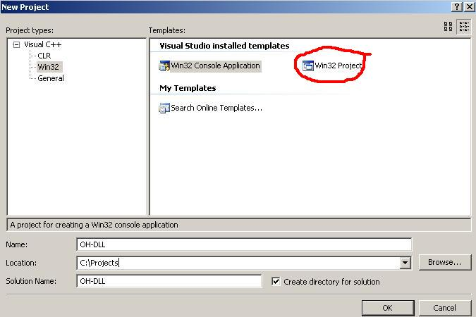

## Step 4

Don’t click the Finish button yet, but click on Next.

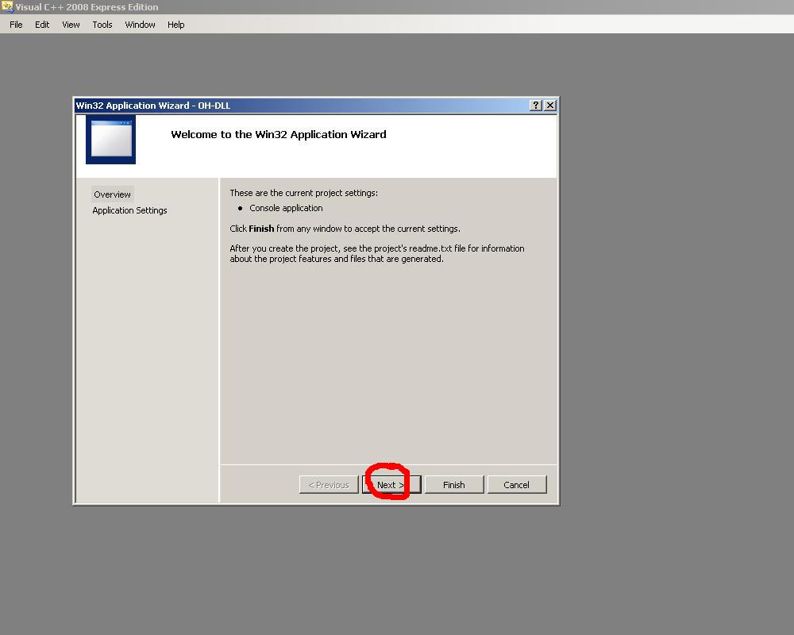

## Step 5

Select DLL and Empty project on the following screen and click the
Finish button now.

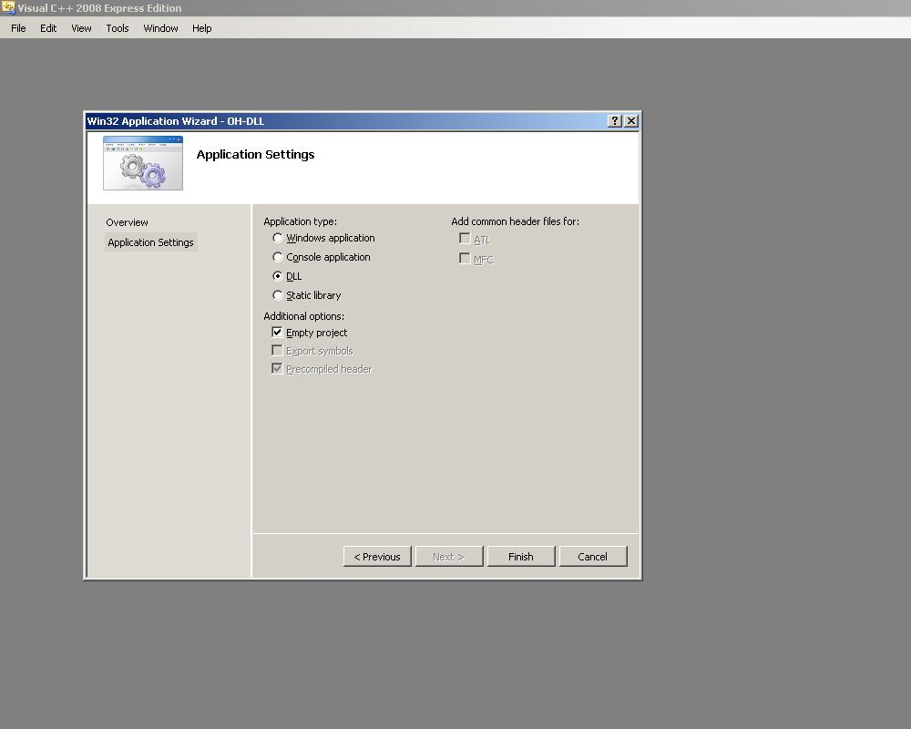

## Step 6

Download and copy the attached files into the project folder, as you can
see on the screen it should be C:\Projects\OH-DLL\OH-DLL. The files are
available at the Wiki:
<http://www.maxinmontreal.com/wiki/index.php5?title=Image:OH-DLL.rar>.

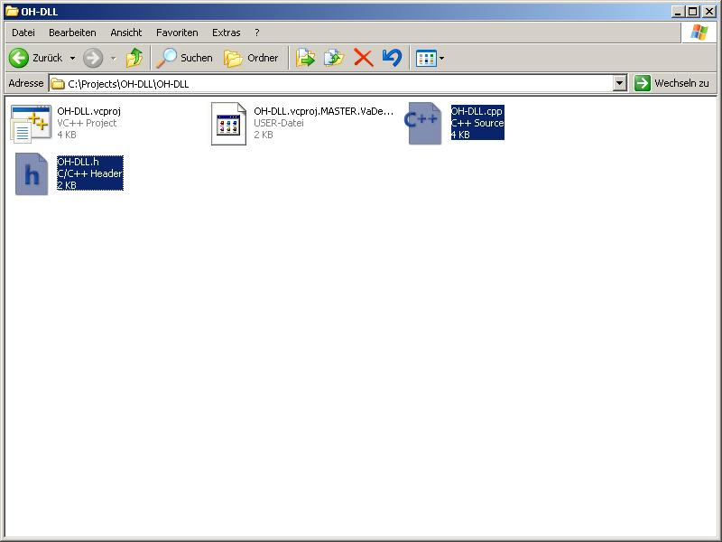

## Step 7

- Open the Solution Explorer: View -\> Solution Explorer

- Add the files to the project, select the Source File folder in the
  Solution Explorer -\> Add -\> Existing Item

- Mark OH-DLL.cpp in your project folder and click add

- Select the Header File folder and add the header file the same way

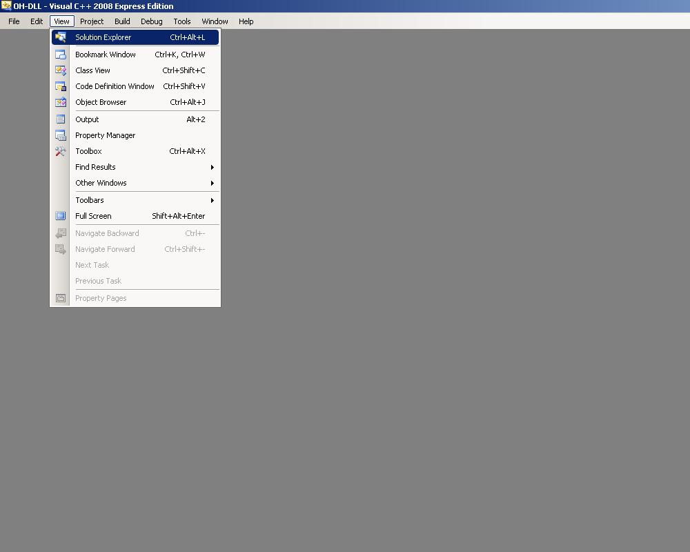

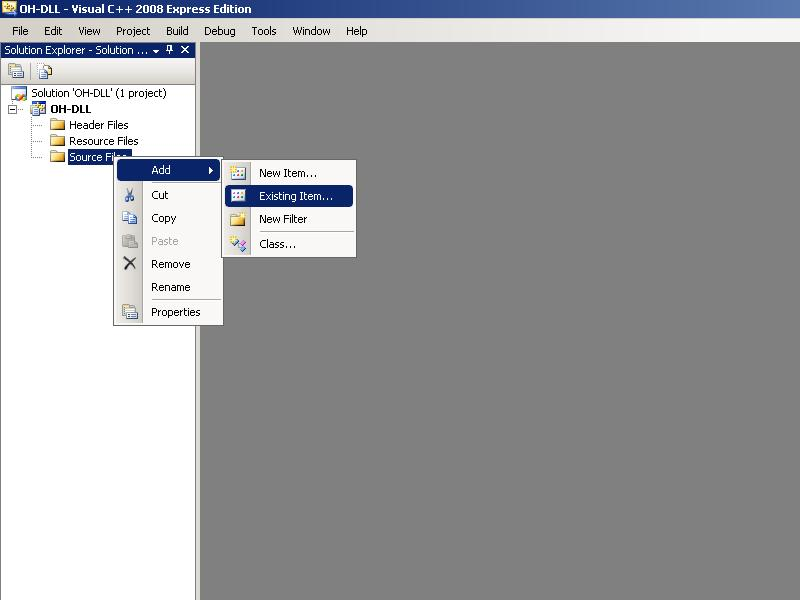

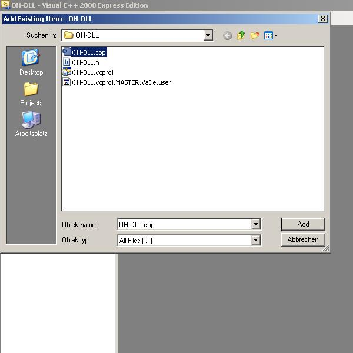

## Step 8

- Now we need to change some options, right-click on the main tree
  OH-DLL, select Properties

- Open the C/C++ tree, select General, select Additional Include
  Directories

- Add the project folder here, c:\projects\oh-dll\oh-dll

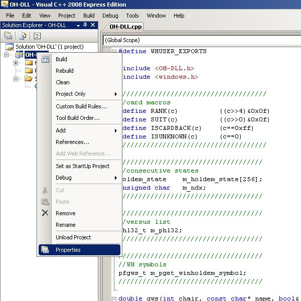

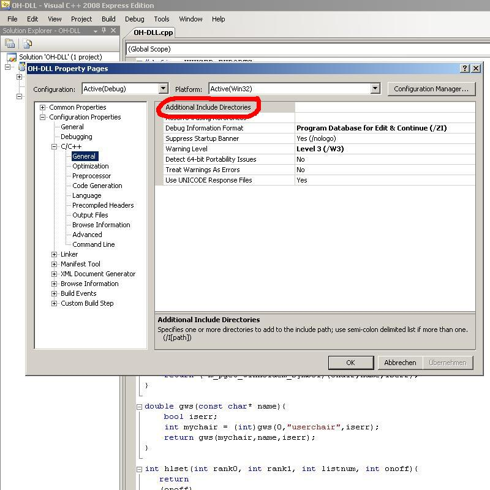

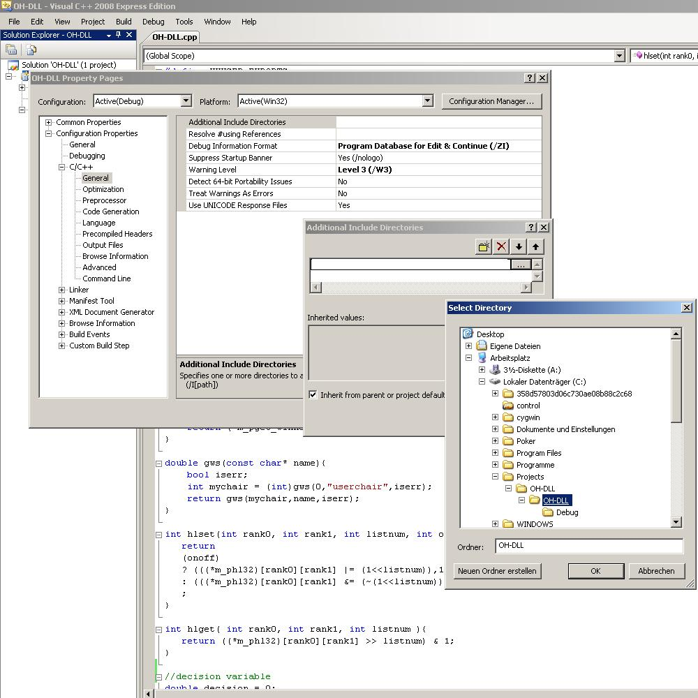

## Step 9

Select Precompiled Headers in the C/C++ tree and select Not Using
Precompiled Headers.

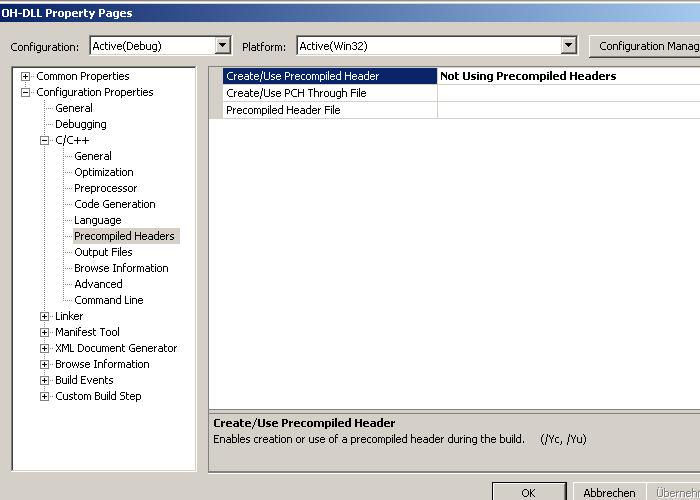

## Step 10

In the Linker tree under General you can change the destination of the
dll Output File if you need.

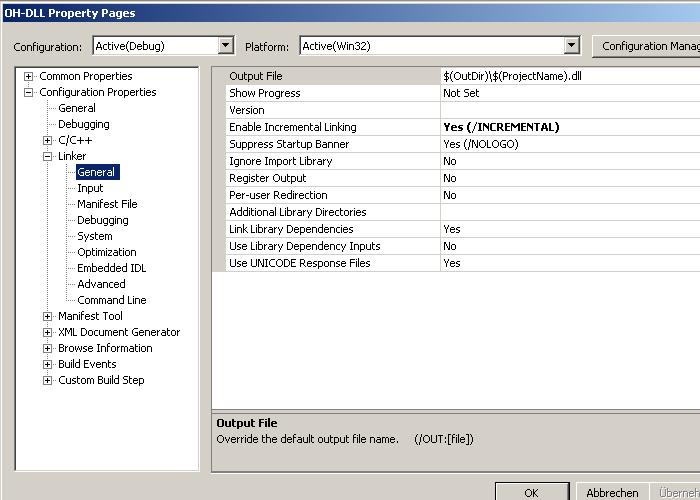

## Step 11

You are ready to compile the dll, click on Build -\> Build Solution or
simply F7.

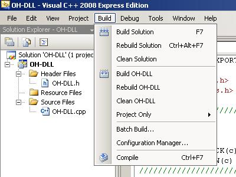
