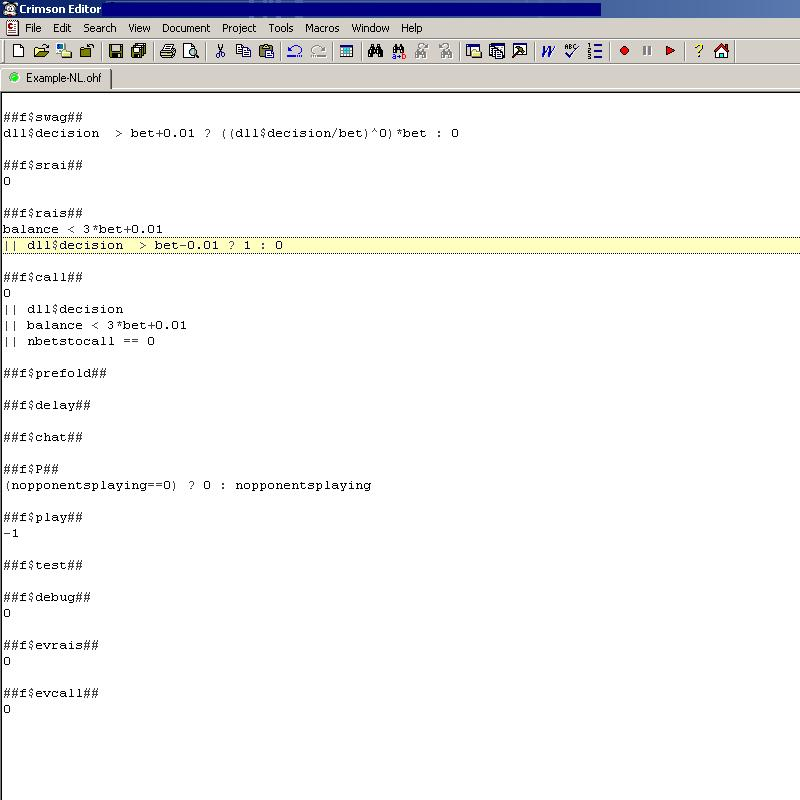

# Setting up the \*.ohf File for DLL Use

This part of the series will concentrate on how we will pass decisions
from the dll to the autoplayer. It’s simple, the \*.ohf file contains
the instructions for the autoplayer and will call the variable from the
dll which contains the decision.

## Setting up the DLL

First we need to introduce a decision, variable. You can download the
files used for this part. I will go through the changes I made:

- Added includes for preflop, flop, turn, river code

- Added include for global vars

- Added decision variable and call in process_query

- Added code to set the decision variable in process_state

## Changes to OH-DLL.cpp

### Include Section

The include section looks like this now:

    #define WHUSER_EXPORTS 
    #include "OH-DLL.h" 
    #include <windows.h> 
    #include <bitset>

    using namespace std;

    #include "OH-globalvars.h" 
    #include "OH-general.h" 
    #include "preflop.h" 
    #include "flop.h" 
    #include "turn.h" 
    #include "river.h"

### Changes to process_querry / process_state

    double process_query(const char* pquery) {
      if(pquery==NULL)      return 0;   
      //example     
      if(strcmp(pquery,"dll$decision")==0)      
        return decision;
      return 0;
    }

    double process_state(holdem_state* pstate) {
      if(pstate!=NULL)       m_holdem_state[ (++m_ndx)&0xff ] = *pstate;
      //resetting decision  
      decision = 0;
      //updating vars   
      int_oh_symbols();
      //calculating decision if it's my turn    
      if(ismyturn){         
        switch(betround){           
        case 1:                 
         decision = preflop();              
         break;             
        case 2:                 
          decision = flop();                
          break;            
        case 3:                 
          decision = turn();                
          break;            
        case 4:                 
          decision = river();               
          break;            
        default:                
          break;        
        }   
      }
      return 0;
    }

You can already see from the comments what is happening here, each time
a new state is scraped:

- int_oh_symbols updates the values of our defined oh-symbol variables.

- the decision variable is reset to .

- when it is our turn (buttons visible) we call the code depending on
  the current betround to set the decision variable.

### Preflop, flop, turn, river includes

Until now they do not contain any code, they simply contain a function
each which returns 0, e.g:

    double preflop() {  
      /*        preflop code    */
      return 0;
    }

My next part of this series will be concentrating on coding a basic
preflop for deep stack NL.

### Include for global vars

    ///////////////////////////////////////////////////////////////////////////////////////////////////////////////////// 
    //OH DLL VARS
    /////////////////////////////////////////////////////////////////////////////////////////////////////////////////////
    //CONSECUTIVE STATES 
    holdem_state    m_holdem_state[256];  
    unsigned char   m_ndx;
    //VERSUS LIST AND PRWIN 
    phl1k_t m_phl1k; 
    pp13 prw1326;
    //SYMBOLS VAR 
    pfgws_t m_pget_winholdem_symbol;
    ///////////////////////////////////////////////////////////////////////////////////////////////////////////////////// 
    //OWN VARS
    /////////////////////////////////////////////////////////////////////////////////////////////////////////////////////
    //GENERAL VARS 
    int ismyturn; 
    int betround; 
    double decision;
    //SUIT VARS 
    int srankhiplayer; 
    int srankbits; 
    int flushrank;

I decided it’s best to keep the vars in one include, as you will have
tons of code later and it will be much more convenient to organise it in
include files. My former NL micro stakes script contained about 50k
lines. As you can see I added two new variables, ismyturn and betround.

### Setting up the \*.ohf file

This is how a \*.ohf file might look for this dll, ofourse I am always
open to suggestions if someone else has any to improve it.

### Code in \##f\$betsize## 

- If our decision is 1 bblind or more we will enter the closest amount
  in bblinds.

### Code in \##f\$call## 

- If for some reason we can’t enter the betsize and your decision is not
  0 we call.

- If the balance is smaller than 3 bblind we call. This is a failsafe,
  in case for some reason we will have put almost all money allin except
  a very small amout which can be left, if you are not very careful.
  Possible reasons are a problem with the exact dezimal representation
  of numbers or improper handling of the slider-bar.

- If we don’t need to call anything we obviously check.

## Files

The files for this tutorial can be found here:
<http://www.maxinmontreal.com/wiki/index.php5?title=Image:OH-DLL-C.rar>.!!!
