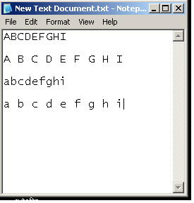
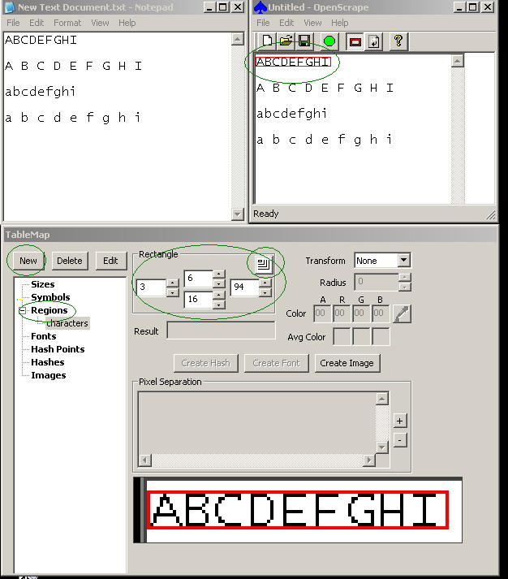
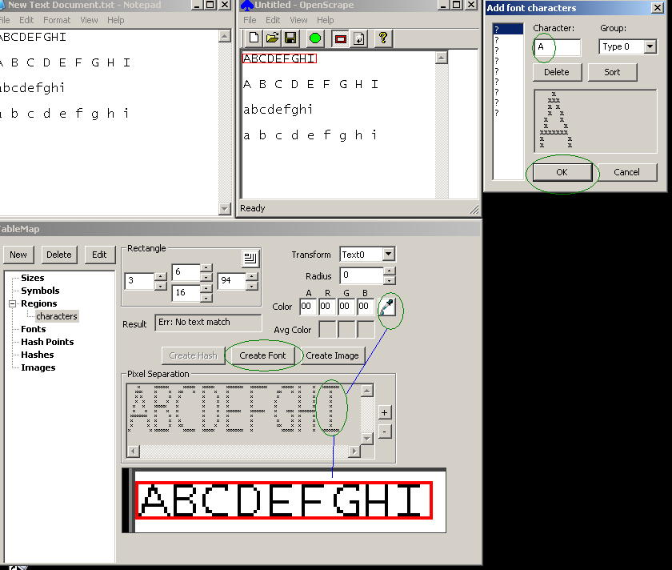
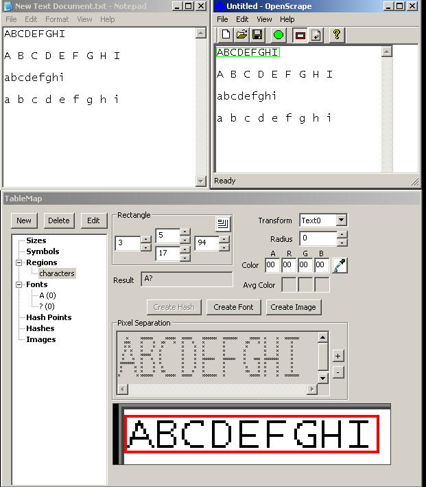
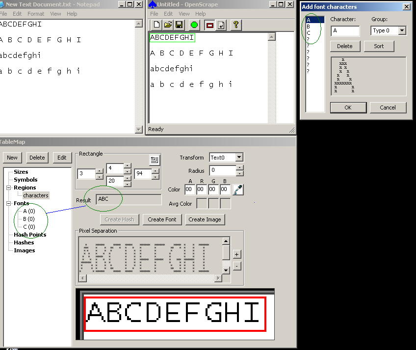
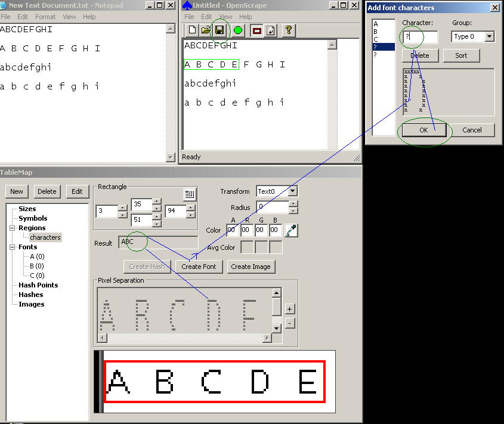

# Collection fonts

This example on collecting fonts was reproduced from the Wiki
(<http://www.maxinmontreal.com/wiki/index.php5?title=Collecting_text>).

We start with nothing except a table that we need to extract fonts from,
here I am using a Notepad document for simplicity.

Next we fire up OpenScrape, and attach it to our Table. Then we build a
region around the area we are working on. Click New -\> Region and name
it characters. Use the coordinate editor to enclose the Region. You can
also shift-drag the rectangle around to place it.

Set the region to the correct transform, Type 0 in this case. Use the
eyedropper to highlight the foreground pixels until we have nice
seperation in the Pixel seperation field. Press Create Font. We are
presented with the Add font characters window. Highlight each ? in turn
and enter the correct character. OK to save. Sort when done here, then
save on main GUI.

If you hit the problem of openscrape seeing two letters as one because
they have touching pixels then you will need to collect them seperately.
Make a new temporary region that only encloses one character (call it
char), capture the problem characters individualy and all should be
good.

Here is the result after collecting only A, you can see this by clicking
inside the characters Region.

A,B,C are already present in the Table Map.

So on we go collecting fonts, here we collect D.

