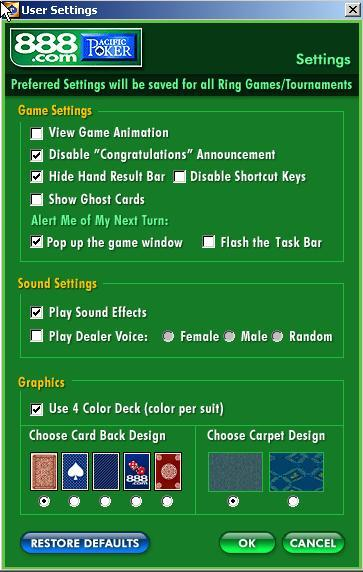
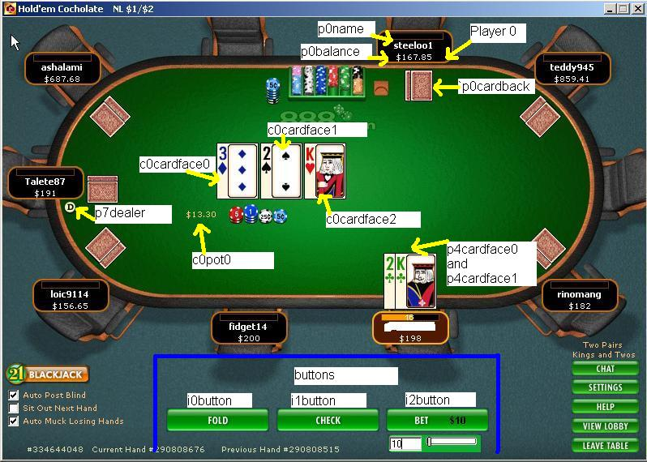
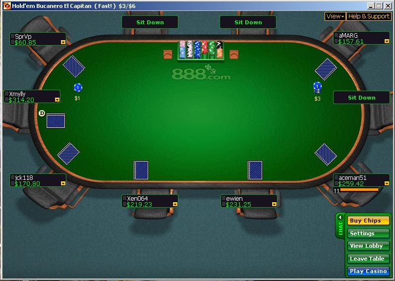
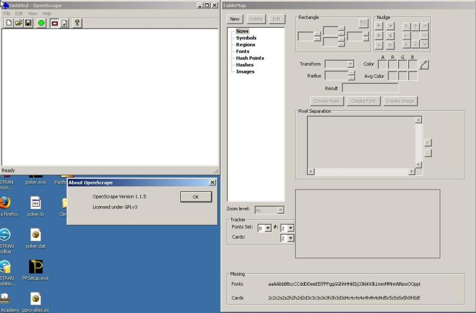
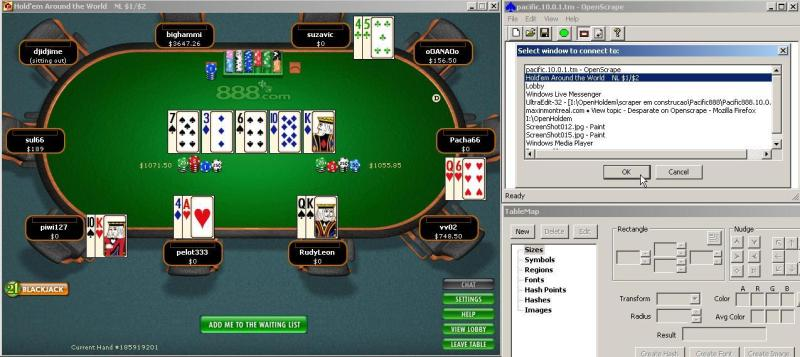
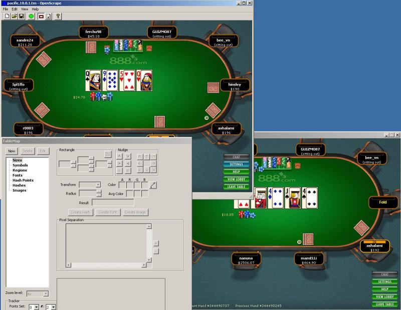
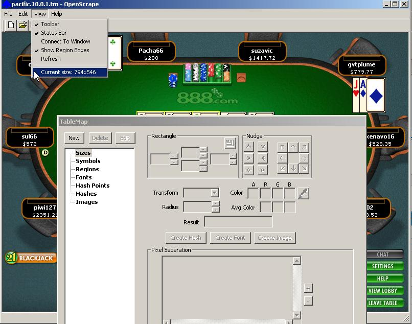
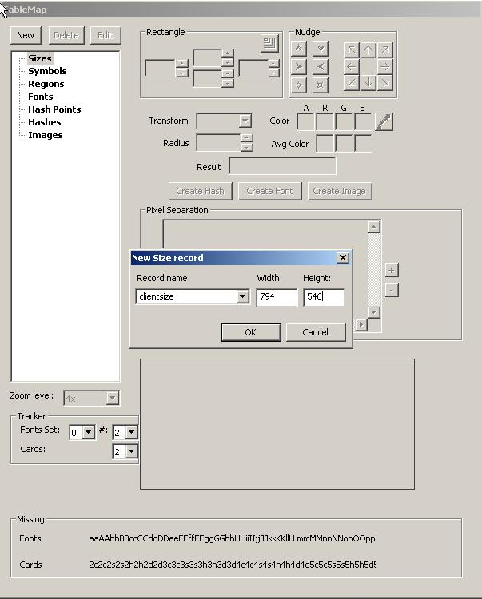

# Getting started

This tutorial got written by a now unknown hero for our former Wiki
(<http://www.maxinmontreal.com/wiki/index.php5?title=Walkthrough>). It
describes a general roadmap for creating a tablemap from scratch given
only openscrape and the target site/table window and nothing else. In
this example we will pretend you are mapping a 10 chair Limit Holdem
table at Pacific Poker.

- download openscrape (OH PC) and save it into a folder of its own ,
  maybe OpenScrape .

- download Pacific poker (Casino PC)
  (<http://setupspcp1.888.com/setups/support/full/en/3.509/pacificpokersetup.exe>),
  create an account and open a Limit 10 seat Holdem Table.

The first step is to check the settings of the table, removing
animations and other things that can be heavy or hinder the operation of
OpenHoldem.

The next images shows some regions that will be used.

The player0 should always be the first to left of the dealer, which sits
usually at the top of the table. The other players should be numbered
clock-wise.

Now open a bring client (OH PC) with the target site/table you want to
map (Pacific 10 seat Limit). Bring will show you a table like the image
below:

Once you have a bring-window open all operations can be executed savely
at your OpenHoldem machine.

The next image shows OpenScrape running.

As a first step we will create a new TM and name it. Just click File –\>
New File –\> Save As. Good naming conventions are:

- first the name of the casino — in our example “Pacific”

- then the game type, as different game types do usually require
  different maps

- then the number of players

- then the version of the tablemap or the date of creation

In our example we will name the tablemap Pacific_NL_10_v0.1.tm.

Now press the green button in OpenScrape and connect to the poker table.

You should see openscrape changing to a copy of the poker window.

Now we have to organize the windows on our desktop.

You can always use the refresh icon to shoot a new image of the poker
window when you need to.

Now click the view menu and note the current size of the table. The
table size is one of the key factors for connecting to a window.

Now expand the Sizes Tree in openscrape, highlight clientsize and hit
Edit. Now add this information to your TM and press OK.

Remember to always save your TM after each modification. To create a
complete map, we would now have to edit all symbols and regions. We will
deal with this process in another tutorial in this manual.
