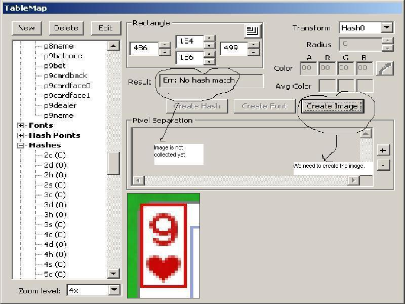
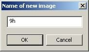
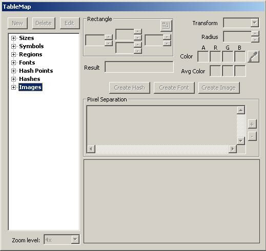
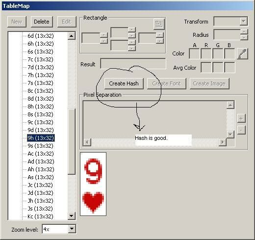
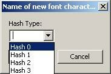
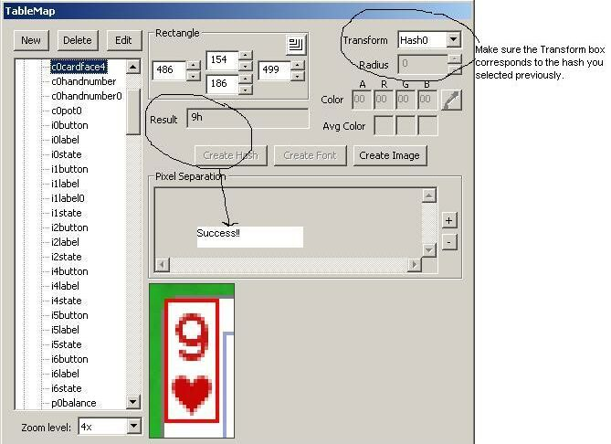

# Hashing Images

Using hash-values is the most easy way to recognize images. They are
applicable whenever images get displayed in a fixed way. “Fuzzyness”
like small changes in size and colour can’t be handles with hashes. They
require fuzzy fonts and cause more work, both for the creator of the map
and at run-time. For this example we take a scraper-friendly casino.

First find the region box that contains the image that you wish to
collect, and select the Create Image tab.

The pop up box for the name will appear. Give your image the proper
name.

Go to the left side of Open Scrape and open the images tree and find
your newly created image and select Create Hash.

In most cases the hash value will be unique. Collisions can happen, but
are extremeley rare. If that is the case you have to change your regions
so that all images get an unique hash-value for identification.

Now select your hash type from the new pop up box. Generally starting
with Hash0.

Go back to the Edit Menu on the Open Scrape Tool Bar and select Update
Hashes from the drop down menu. Confirm the process was succesfull by
clicking on the box that contained the origional image. As soon as you
have selected the region OpenScrape should show you the desired result:
the cards name, in our case nine of hearts.

