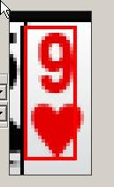
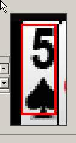
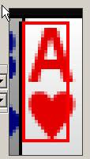
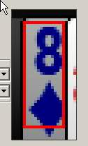
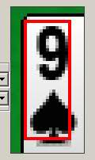

# Scraping In Practice

## How Do I Make A Map

This tutorial has been contributed by Ares® at
<http://www.maxinmontreal.com/forums/viewtopic.php?f=117&t=6547>.

Here I will show you how I make a map from start to finish. We will
concentrate on cards-scraping and the sometimes used chip-scraping here.
The more easy text-scraping, which usually gets chosen for scraping the
bets will be explained in another chapter of this manual.At first we
check the version to avoid any surprises if the casino updates. These
casino updates rarely affect the table-display, but sometimes they do
and throw the scraper off.

<figure>

</figure>

Then we choose proper settings amd disable useless features like avatars
and animations that could affect scraping. I also enable other features
that ease scraping, especially the four-colour-deck.

<figure>

</figure>

Then we choose a nice table-view, the simpler the better.

<figure>

</figure>

This is how our poker table looks with our preferred settings

<figure>

</figure>

Checking this table display, we notice some good things and also some
possible problems to care about:

- fonts are two colours, we have to use pXname / uXname for the names
  and pXbalance / uXbalance for the balance. In similar cases we might
  consider to use the background-colour in combination with a negative
  radius to accept both foreground-colours at once, but here we have two
  different background-colours, therefore this alternative approach can
  hardly be used.

- the dealer button is large and well positioned

- the cards are always exactly the same. Therefore we can use hashes,
  images or fuzzy fonts, but I will use hashes, as they are the most
  easy ones and the fastest.

- it might happen, that large chip-stacks occlude opponents card-backs.

### Scraping Cards

There are three methods for collecting cards

- using hashes, i.e. using the image to compute a number and then doing
  a quick search for a match. This is the most simple method, but it
  requires that each card gets displayed exactly identically, at all
  times and at all possible places. We will ise hashes here, as
  Full-Tilt is a bot-friendly casino from a scraping point of view.

- using images. This approach is similar to the one above, but it
  requires more resources. This approach will be discussed in another
  chapter of this manual.

- using fuzzy fonts. This is “true screen-reading”, somewhat more
  complicated, but it is possible to recognize cards that get displayed
  each time a little bit differently. As already mentioned in the
  introduction we will discuss this method in another chapter too.

So let’s start with the card-scraping. We have five common-cards and two
hole-cards in the situation below.

<figure>

</figure>

As you can see I pre-created five regions for the common cards, but in
order to be able to define their size and position we have to care about
my hole-cards. One of them is partially occluded and we would like to
recognize all cards with the same hashes, therefore this card defines
the size of our scraping region.

    width  381 - 368 = 13
    height 431 - 395 = 36 

Please have a look at the region marked by arrow 3.The left border of
the region matches the border of the card, but at the top is a free
distance of one pixel. That’s how we will align the regions for all
other cards too.

<figure>

</figure>

Next step: we take the size of the card-scraping region (13x36) and
apply it to the common cards. All regions now appear with the correct
size. but in the upper left corner (0, 0), as the position is still
undefined (please see the blue arrow). Now we select these regions and
click-drag them to the right places

<figure>

</figure>

Now the common-cards are done. Always make sure that we use the same
alignment for all cards.

<figure>

</figure>

Now we check the alignment of the common cards. All regions should have
the same height. The space between two regions should be equal. If the
position of the fourth card can change (Ipoker, CakePoker) we should use
fuzzy fonts.

<figure>

</figure>

After I have aligned the common cards I will create and align the cards
for all players. Once this got done, I will seek a play money table, the
most loose one I can get. This is one of the secrets of quick TM
creation; I already managed to get 20 cards at once. So now I will
create the regions p0cardface0 / p0cardface1. In OpenSrape I already
created the region for the first player (player0). You can see that I
chose the correct size of 13x36 and also chose hash0 transform. Now I
save the tablemap and close OpenScrape to clone these regions with an
external editor..

<figure>

</figure>

Here I opened the file in a text editor (notepad++ from
<a href="notepad-plus-plus.org" class="uri">notepad-plus-plus.org</a>).
You can see the two regions that we created for the first player.

<figure>

</figure>

Now I copy and paste the region’s of the first player several times...

<figure>

</figure>

...and rename the cloned ones, so that we get cardfaces for all 9
players (p0...p8).

<figure>

</figure>

(On a side-note: cloning regions became more easy in the mean-time. Just
create all regions for player0 and the balance-regions for all other
players, plus the first common cards. Then click Menu Edit Clone Regions
and all other regions will be created and even aligned to reasonable
places. All you have to do is a little bit of fine-tuning the
positions.)

In the next screenshot you see all cloned regions in OpenScrape, ready
for positioning by drag and drop.

<figure>

</figure>

*Be careful!*

<figure>

</figure>

Today we received a gift from Ultimatebet. Their client has been
updated, but it was only an update of internal functions, nothing that
affected the user-interface. This is mostly the case with casino updates
and one of the benefits of scraping: updates might happen often, but the
interface changes rarely and mostly only slightly. But always be aware
of updates.

Now let’s continue with the good work: drag and drop. Select the region
you want to move, in the example p7cardface0. The region will be
flashing in yellow. Press the Shift key, put the mouse pointer over the
region, click and move the region to the desired place. placing
conventions: player0 sits at 1-o-clocl-position, the other players are
seated clockwise..

<figure>

</figure>

Do you notice the cards marked with arrows? They are not aligned
properly. You can check this if you select them while they show cards.

<figure>

</figure>

We have to fine-tune these regions, so that all are aligned properly.

|  |  |  |  |  |
|:--:|:--:|:--:|:--:|:--:|

Checking alignment again. Pay close attention; if one region is
misaligned, all data collected from this region will be wrong.

<figure>

</figure>

Now we start collecting cards

1.  select the region

2.  click Create Image

3.  choose a good name like “8s”

4.  click OK

Repeat this process until all cards are collected.

<figure>

</figure>

Creating hashes – step 1

1.  select image (8s)

2.  click Creat Hash

3.  select Hash 0

4.  click OK

<figure>

</figure>

Creating hashes – step 2

1.  Click Menu Edit

2.  Click Update Hashes

<figure>

</figure>

Now OpenScrape already recognizes the card 8s

<figure>

</figure>

As the next step we would like to create the regions pXbet, but the
picture below shows an occlusion of bets by chip-stacks. Scraping the
bet-amount is the preferred solution, as it is easy and doesn’t utilize
the CPU much. Unfortunately the occlusions prevents scraping the
bet-amounts directly in our case. Therefore we have to use the
alternative method chip scraping, i.e. recognizing and counting
chip-stacks. We will use the regions pXchip00, pXchip01 and pXchip10 for
players, i.e. the bottom chip of the left-most stack, the 2nd-chip in
the same stack and the bottom-chip in the 2nd stack. All other chip
positions are then welldefined. The common pots work similar:
c0potXchip00, c0potXchip01, c0potXchip10 for pot X.

<figure>

, 

</figure>

Chip scraping

<figure>

</figure>

The timer of player8 covers the chip-stack partially. Therefore I will
reduce the size of the scraped region to 22x7.

<figure>

</figure>

Then I open the TM in a text editor and pre-create the new regions, just
like I did with the cards before.

<figure>

</figure>

The best place to align the pXchipXX regions is in the blinds, because
there we get to see often single chips.

<figure>

</figure>

The chip should be collected as an image. The name of the picture must
have a \$ at the beginning (examples: \$0.01, \$0.25, \$1, \$5,
\$100000)

<figure>

</figure>

We will use hash points for recognizing chips, but not hash0 which is
already in use, but this time hash1 to avoid potential hash-conflicts,
even if they are very unlikely. We create these hash points with the
Graphical Hash Point Editor

1.  click *Hash Points*

2.  click *Edit*

3.  select the hash type

4.  select one chip image

5.  zoom to 16x

<figure>

</figure>

As you can see we created two new hash points of type hash1 for this
chip. Please note, that both points are at the side panel of the chip,
which is always visible, even if the stack consists of multiple chips.
We want OpenHoldem to be able to count them properly.

<figure>

</figure>

As it turned out both the \$1 chip and the \$1000 chip show the same
white pixel at the formerly chosen hash-points (marked by arrows) This
causes a hash collision and forces us to fine-tune the location of the
points so that all chips can be properly recognized.

<figure>

</figure>

Next we have to care about the location of additional chip stacks. As
you can see they can grow in different directions for different
playewrs.

<figure>

</figure>

This determines the placement of our chip regions. pXchip00 is always
the first chip, pXchip01 is always on top of that and pXchip10 is the
bottom chip of the second chip stack. OpenHoldem is then able to detect
all other chip-stacks and all additional chips on top automatically.

<figure>

</figure>

Here you can see the pXchipYZ aligned in OpenScrape.

<figure>

</figure>

Now we have a nearly working tablemap. It recognizes cards and bets.
Names are optional and only necessary for PokerTracker and other kinds
of opponent modelling. The balances are also necessary, they can be done
with font-scraping, which will be discussed in another chapter. We are
nearly finished now, but to make use of this fine map we have to tell
OpenHoldem how to connect to a table. This happens by table-size and
title-string (and in some rare cases by optional table-points, if
different game-types (6max / 10max) can’t be played with the same map).

So first we have to define the symbol *clientsize.* The necessary value
gets provided by OpenScrape.

<figure>

</figure>

Next we have to define a titletext. It should be unique for each casino
(at least if other casinos have the same table size), but it should
match all game-types that are supported by our map. Our map supports NL,
FL and PL, which share the string Holdem, so we choose this one as a
title identifier.

<figure>

</figure>

The *titletext* is a symbol-record that can be defined easily with the
tablemap editor.

<figure>

</figure>

We also have to tell the scraper how many chairs the tablemap supports.

<figure>

</figure>

As you can see in the title OpenHoldem is connected to the table (and
the map would work if we also defined which chair is seated).

<figure>

</figure>

Now we also need common pots (this includes side-pots). They work
similar to bets and chip-stacks. Here c0potXchip00, c0potXchip01 and
c0potXchip10.

<figure>

.

</figure>

Most sites have three pots, but Ultimatebet has five pots (the fifth pot
does not appear in the situation below, but we show its location)

<figure>

</figure>

That’s it – basically.
