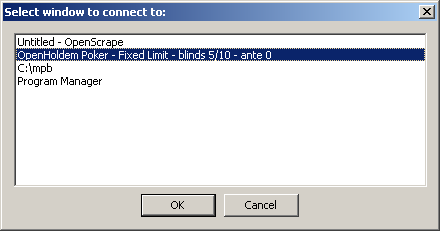
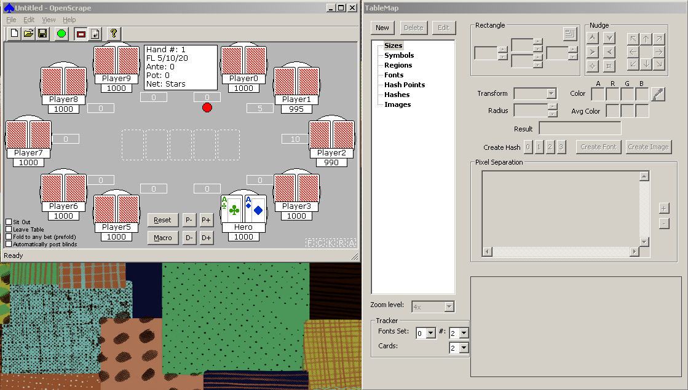

# First things first: connect to the poker window

Start a casino, and open up a play money table. For the greatest part of
building a table map you could even use “observer” mode if you like;
only a few things like buttons will require a “real” account .
Alternatively, once you learn how to use saved frames and OHReplay, you
can also connect OpenScrape to these saved frames while offline from the
casino.

For now, let’s keep it simple. Once you have a poker table setup,
startup the OpenScrape program from the “c:\mpb” directory that you set
up above. Arrange the casino table window and the OpenScrape windows on
your screen in such a way that there is no overlap – OpenScrape needs a
clear view of the poker table window to do its job.

<figure>

</figure>

Connect OpenScrape to the casino table by clicking on the Green Circle
Button on the OpenScrape toolbar. A dialog with a list of top-level
windows that are currently visible on your screen will appear. Select
the one from the list that matches your casino table, and select OK.
(Note, in this screenshot, we are connecting to a “ManualMode” window.
You will learn more about ManualMode later in this document, but for
now, just consider ManualMode to be a simulated, offline poker table).

A static image of the poker table window will be displayed in
OpenScrape’s main window. Once OpenScrape has the poker table’s image
displayed, you can minimize the poker table if you want, to give
yourself more room to work. As the casino table changes state, and if
you want to update the image that is displayed in the OpenScrape main
window, you can do so at any time by clicking on the refresh button on
the toolbar (Black and White arrows), or by choosing View/Refresh from
the menu. When a refresh is requested, OpenScrape will bring the
connected window to the front, grab the image, and then place it to the
back again. Additionally, if you have OpenScrape connected to an
OHReplay window, it automatically moves OHReplay to the next saved frame
prior to grabbing the image.

Once we have the poker table image in OpenScrape, it is time to start
building our Table Map, and providing the parameters that the OpenHoldem
game state engine will use to “read” the poker table.
